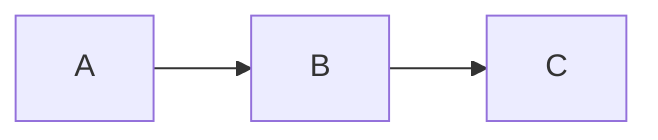

# Neobrutalism for Marp

A Marp theme in the neobrutalist style: thick borders, offset box-shadows with zero blur, flat fills, near-monochromatic palette with one bold accent.

No upstream design system, the tokens are defined directly in `src/build.js`.

## Preview

Run `npm run example` to generate `examples/deck.html`, `examples/deck.pdf`, and `examples/deck.pptx`.

## Quick start

A fresh deck folder with full theme support, including per-slide Mermaid light/dark theming, in three steps.

**1. Install in a new folder:**

```bash
mkdir pitch-deck && cd pitch-deck
npm init -y
npm install github:msradam/marp-neobrutalism @marp-team/marp-cli mermaid
```

**2. Drop in `.marprc.js`:**

```js
const path = require('path');
const engine = require.resolve('marp-neobrutalism');
const root = path.dirname(path.dirname(engine));
module.exports = {
  engine,
  themeSet: [path.join(root, 'themes')],
  html: true,
  allowLocalFiles: true,
};
```

**3. Write `deck.md`:**

````markdown
---
marp: true
theme: neobrutalism
paginate: true
---

# Hello

---


````

Render:

```bash
npx marp --config .marprc.js deck.md -o deck.pdf
# or -o deck.html / deck.pptx
```

Per-slide Mermaid palette switching works out of the box because this package ships a custom Marp engine that re-themes each diagram based on the slide's class (`dark`, `invert`, etc.).

## Light install (theme only, no Mermaid theming)

If you don't want a `node_modules/` folder in your deck directory, save just the CSS to a central location:

```bash
mkdir -p ~/.marp/themes
curl -sL https://raw.githubusercontent.com/msradam/marp-neobrutalism/main/themes/neobrutalism.css      -o ~/.marp/themes/neobrutalism.css
curl -sL https://raw.githubusercontent.com/msradam/marp-neobrutalism/main/themes/neobrutalism-dark.css -o ~/.marp/themes/neobrutalism-dark.css
```

Render with the CSS directly:

```bash
marp --theme ~/.marp/themes/neobrutalism.css deck.md -o deck.pdf
```

Mermaid blocks still render but with default colors instead of theme-aware ones. For full theming, use the Quick start above.

### VS Code live preview

Install [Marp for VS Code](https://marketplace.visualstudio.com/items?itemName=marp-team.marp-vscode). Open your user settings JSON (`Cmd/Ctrl+Shift+P`, then `Preferences: Open User Settings (JSON)`) and add:

```json
{
  "markdown.marp.themes": [
    "/Users/YOU/.marp/themes/neobrutalism.css",
    "/Users/YOU/.marp/themes/neobrutalism-dark.css"
  ]
}
```

Replace `/Users/YOU` with the output of `echo "$HOME"`. Any `.md` with `marp: true` and `theme: neobrutalism` in the front matter now previews with this theme. The VS Code extension uses its own engine and won't run the per-slide Mermaid theming, but it's ideal for writing and live preview. Use the Quick start CLI command for final exports.

## Per-slide variants

| Class            | Effect                                                   |
| ---------------- | -------------------------------------------------------- |
| `lead`           | Accent-color full-bleed background, bottom-anchored title |
| `split`          | Two-column grid                                          |
| `dark` / `invert`| Black background, white borders and shadows              |
| `accent`         | Yellow content slide for callouts                        |
| `light`          | Force light tokens inside a `neobrutalism-dark` deck     |

## Customizing

```yaml
---
marp: true
theme: neobrutalism
style: |
  section {
    --nb-accent: #ff6b6b;
    --nb-shadow: 6px 6px 0 #000;
  }
---
```

### Tokens

| Token                | Default              | Purpose                    |
| -------------------- | -------------------- | -------------------------- |
| `--nb-bg`            | `#ffffff`            | Slide background           |
| `--nb-layer`         | `#f2f2f2`            | Element backgrounds        |
| `--nb-text`          | `#000000`            | Primary text               |
| `--nb-text-secondary`| `#333333`            | Footer, page numbers       |
| `--nb-border`        | `#000000`            | Border color               |
| `--nb-border-width`  | `2px`                | Border thickness           |
| `--nb-shadow`        | `4px 4px 0 #000000`  | Offset shadow              |
| `--nb-shadow-sm`     | `2px 2px 0 #000000`  | Small offset shadow        |
| `--nb-accent`        | `#f5c842`            | Accent color               |
| `--nb-accent-text`   | `#000000`            | Text on accent background  |
| `--nb-font`          | Space Grotesk        | Sans-serif font stack      |
| `--nb-mono`          | Space Mono           | Monospace font stack       |
| `--nb-pad`           | `60px`               | Slide padding              |

## Files

```
themes/
  neobrutalism.css       # light theme
  neobrutalism-dark.css  # dark default variant
engine/
  index.js               # Mermaid fence renderer + per-slide theming
mermaid/
  index.js               # near-monochromatic Mermaid palette
src/
  build.js               # defines tokens and generates themes/
examples/
  deck.md                # demo deck
  deck.html              # rendered HTML
  deck.pdf               # rendered PDF
  deck.pptx              # rendered PowerPoint
```

## Credits

Persona illustrations in `examples/img/` by [Victoruler](https://www.flaticon.com/authors/victoruler) on [Flaticon](https://www.flaticon.com/).

## License

MIT.
