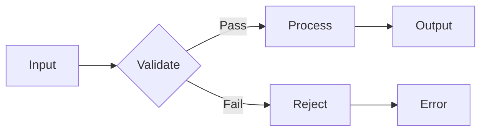
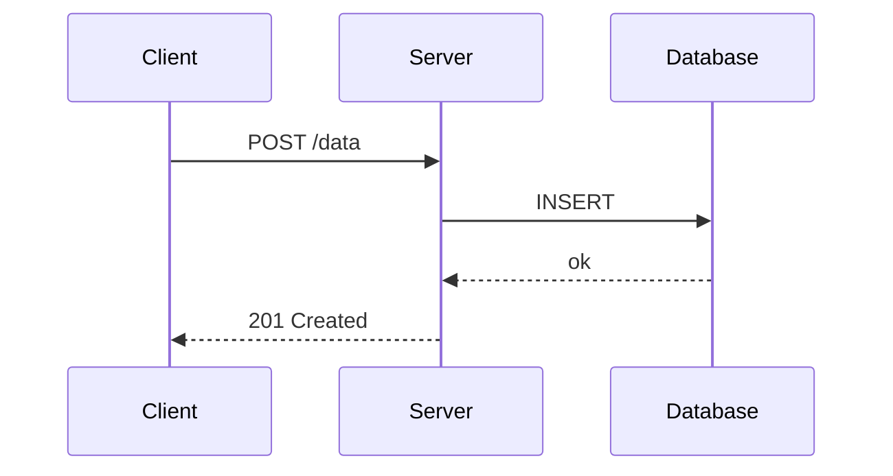

<!-- _class: lead -->
<!-- _footer: '' -->
<!-- _paginate: false -->

# Neobrutalism **for Marp**

## Thick borders. Flat fills. Offset shadows.

---

###### What is this

# What's in the box

- Space Grotesk, bold grotesque sans-serif
- Thick 2px borders on every element
- 4px offset box-shadows, zero blur
- Near-monochromatic: black, white, and one accent
- Yellow accent (`#f5c842`), swap it with any color

---

## Typography

Headings are **heavy and tight**. Body text stays readable at weight 400. Inline `code` gets a bordered box. Everything is zero border-radius.

> Decoration is not design. Structure is design.

---

<!-- _class: split -->

## Two columns

Use `<!-- _class: split -->` for side-by-side content.

- Thick border top rule
- Offset shadows on code and tables
- The accent shows up in table headers and marks

```python
def brutalize(design):
    design.border = "2px solid black"
    design.shadow = "4px 4px 0 black"
    design.radius = 0
    return design
```

---

<!-- _class: dark -->

## Dark mode

`<!-- _class: dark -->` flips to black background with white borders and white offset shadows. The accent stays yellow.

```ts
type Border = 'thick' | 'thicker';

const rule: Record<Border, string> = {
  thick:   '2px solid #fff',
  thicker: '4px solid #fff',
};
```

---

<!-- _class: accent -->

## Accent slide

`<!-- _class: accent -->` gives you a full yellow content slide, useful for callouts, warnings, or emphasis.

Use it sparingly. That's the whole point.

---

## Tables

Tables get the full treatment: accent header, shadow, thick border.

| Property     | Default              | Override via          |
| ------------ | -------------------- | --------------------- |
| Border       | `2px solid #000`     | `--nb-border-width`   |
| Shadow       | `4px 4px 0 #000`     | `--nb-shadow`         |
| Accent       | `#f5c842`            | `--nb-accent`         |
| Font         | Space Grotesk        | `--nb-font`           |
| Radius       | `0`                  | (don't)               |

---

## Math

Inline: $E = mc^2$. Display:

$$
\sum_{k=1}^{n} k = \frac{n(n+1)}{2}
$$

---

## Mermaid diagrams

Diagrams use a near-monochromatic palette. Accent yellow on primary nodes, thick black borders throughout.



---

<!-- _class: dark -->

## Mermaid on dark



---

###### Personas

# Three users

  

Inline. Sized with `![w:220]`. Wrap in `<figure>` for the thick-border / offset-shadow treatment.

- ``, inline, no decoration
- `<figure><figcaption>...</figcaption></figure>`, brutalist border + shadow

---

<!-- _class: lead -->
<!-- _paginate: false -->

# Thanks
